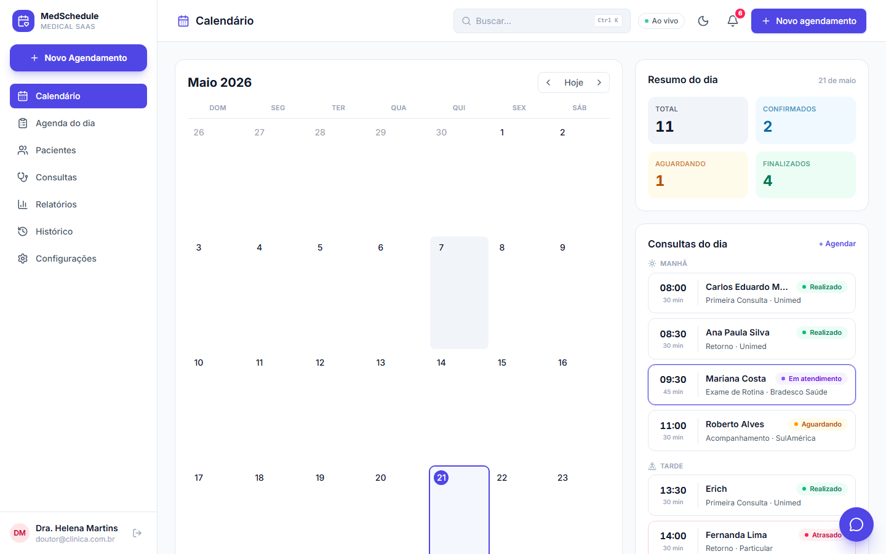
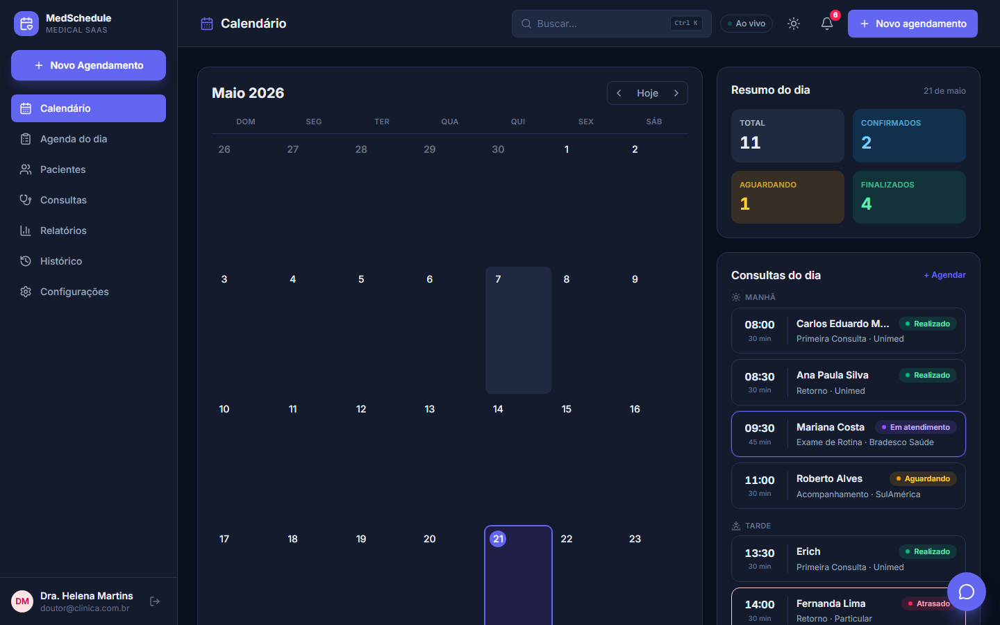
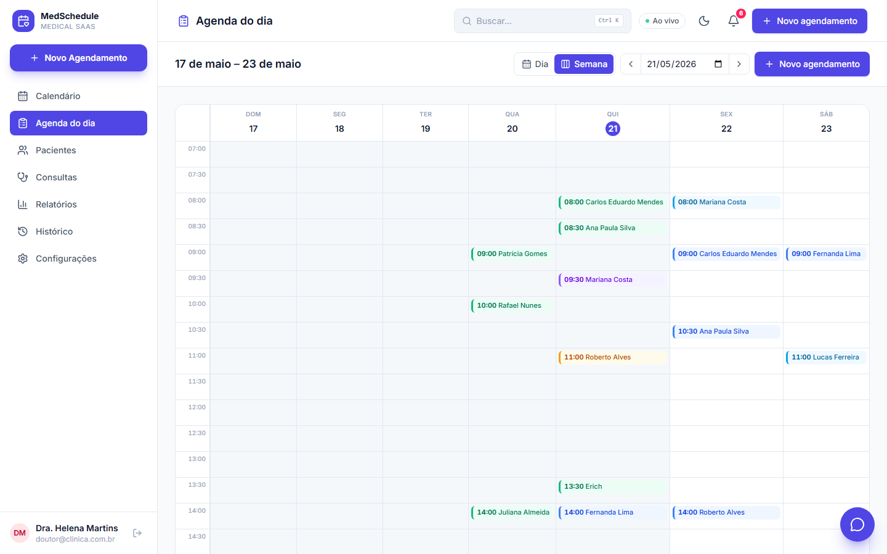
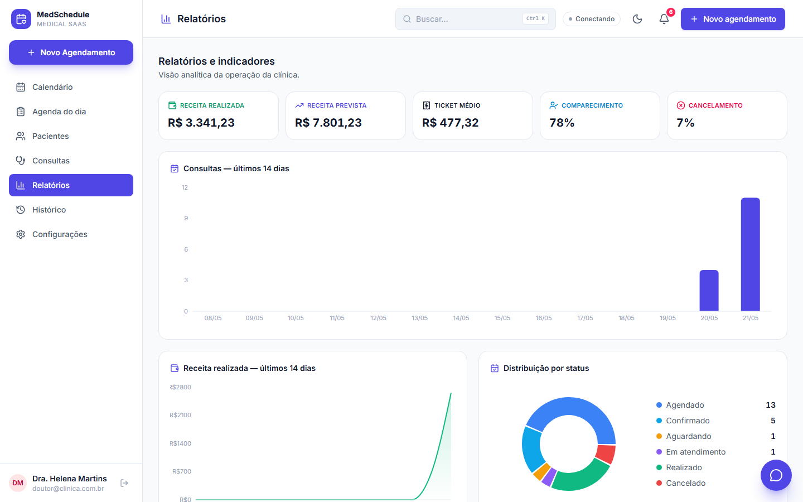
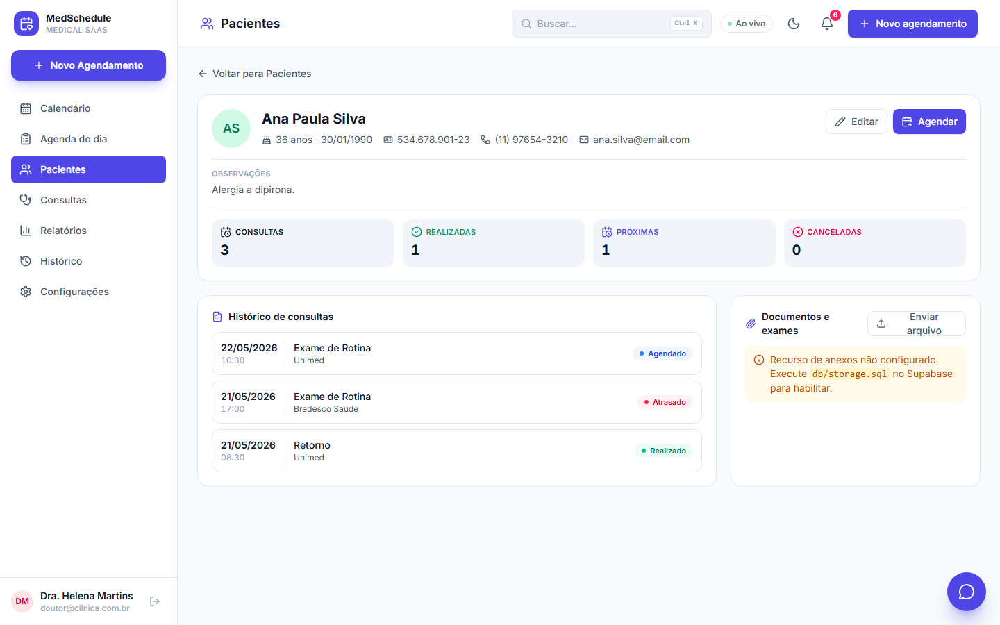
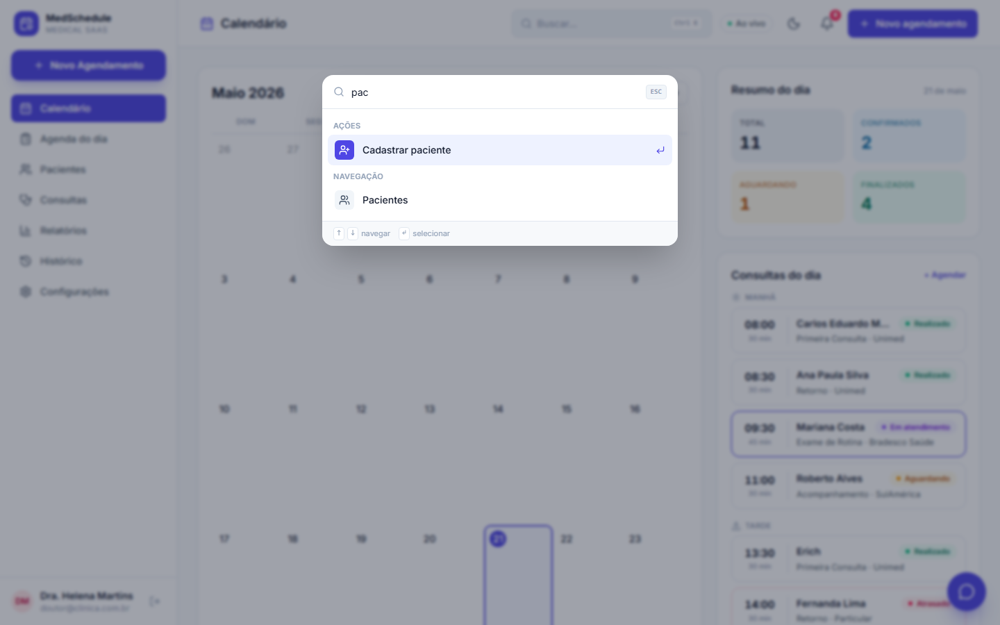

# 🩺 MedSchedule — Sistema de Agenda Médica

[](https://github.com/erichs890/MedSchedule/actions/workflows/ci.yml)

Sistema de agenda médica para clínicas pequenas, consultórios e profissionais
da saúde. Centraliza agendamentos, gestão de pacientes, prontuário e
acompanhamento de consultas — substituindo papel, planilhas e agendas físicas.

Desafio técnico desenvolvido com **Next.js + TypeScript + TailwindCSS +
Supabase**, seguindo o design system "Clinical Precision" do protótipo.

## 📸 Telas

| Tema claro | Tema escuro |
| --- | --- |
|  |  |

| Agenda semanal (drag & drop) | Relatórios e indicadores |
| --- | --- |
|  |  |

| Prontuário do paciente | Busca global (Ctrl/⌘+K) |
| --- | --- |
|  |  |

---

## 🔑 Acesso de demonstração

```
E-mail:  doutor@clinica.com.br
Senha:   medschedule123
```

## ▶️ Como rodar

```bash
npm install
npm run dev          # http://localhost:3000
npm run test         # testes unitários (Vitest)
npm run test:e2e     # testes ponta a ponta (Playwright)
```

> O arquivo `.env.local` (credenciais) **não é versionado** por segurança.
> Copie `.env.example` para `.env.local` e preencha — veja
> [Configuração](#-configuração-supabase--ia--google).

## 🧰 Stack

| Camada         | Tecnologia                                       |
| -------------- | ------------------------------------------------ |
| Framework      | Next.js 16 (App Router) + React 19 + TypeScript  |
| Estilo         | TailwindCSS v4                                   |
| Backend / BD   | Supabase — PostgreSQL, Auth, Realtime, MFA, Storage |
| Estado / cache | TanStack Query (React Query)                     |
| Gráficos       | Recharts                                         |
| IA             | Google Gemini                                    |
| Testes         | Vitest (unit) + Playwright (e2e)                 |

---

## ⭐ Diferenciais (além do escopo do desafio)

| # | Diferencial | Descrição |
|---|-------------|-----------|
| 🧠 | **IA na anotação clínica** | Reescreve a anotação livre em formato clínico estruturado (Google Gemini). |
| 💬 | **Assistente virtual (Sofia)** | Chatbot com IA que responde dúvidas sobre a clínica, convênios e uso do sistema. |
| 📊 | **Relatórios e indicadores** | Dashboard analítico com gráficos: receita, ticket médio, comparecimento, cancelamento. |
| 🗓️ | **Visão semanal com drag & drop** | Calendário semanal — arraste uma consulta para reagendar. |
| 📋 | **Prontuário do paciente** | Perfil completo com histórico clínico e upload de exames/documentos (Supabase Storage). |
| ⚡ | **Sincronização em tempo real** | A agenda atualiza ao vivo entre usuários (Supabase Realtime). |
| 🔐 | **Verificação em duas etapas (MFA)** | Autenticação de dois fatores por TOTP (app autenticador). |
| 🔔 | **Central de notificações** | Sino que lista consultas atrasadas, pacientes aguardando e próximos atendimentos. |
| ⌨️ | **Command palette (Ctrl/⌘+K)** | Busca global e ações rápidas por teclado. |
| 👤 | **Cadastro + login com Google** | Registro de usuários e autenticação social (OAuth). |
| 📱 | **PWA + responsividade** | App instalável; layout fluido para mobile, tablet e desktop. |
| 🌗 | **Tema claro e escuro** | Alternância de tema com persistência e detecção da preferência do sistema. |
| 🛡️ | **Segurança** | RLS, MFA, headers de segurança e rate limiting nas rotas de IA. |

---

## ✅ Funcionalidades do MVP

- **Autenticação** — login com e-mail/senha, cadastro e login com Google; rotas protegidas.
- **Calendário / Dashboard** — calendário mensal com indicadores e resumo do dia.
- **Agenda diária** — turnos Manhã/Tarde/Noite com os estados visuais (normal, em
  atendimento, realizado, cancelado, atrasado).
- **Agendamentos** — criação, edição, cancelamento e detalhe em painel lateral,
  com anotação clínica, histórico e fluxo de status.
- **Pacientes** — cadastro com máscaras e validações, listagem com busca e prontuário.
- **Consultas**, **Histórico**, **Configurações** e **página 404**.

Toda ação ocorre **sem reload**, com feedback via toast.

## 🧪 Qualidade e engenharia

- **Testes unitários** (Vitest) para as regras de negócio e formatações.
- **Testes e2e** (Playwright) cobrindo login, navegação e proteção de rotas.
- **CI no GitHub Actions** — lint, testes e build a cada push.
- **Error boundaries** (`error.tsx`, `loading.tsx`, `global-error.tsx`) — o app
  nunca quebra em tela branca.
- **TypeScript** estrito e **ESLint** sem warnings.

## 📋 Regras de negócio

- Atendimento das **07:00 às 19:00** em slots de **30 minutos**.
- Fluxo de status: `agendado → confirmado → aguardando → em atendimento →
  realizado`; cancelamento a partir de agendado/confirmado.
- Não é permitido dois agendamentos no mesmo horário (índice único no banco).
- Consultas canceladas/realizadas permanecem no histórico e não são editáveis.
- Consultas vencidas e ainda não atendidas recebem o estado visual **"Atrasado"**.

## 🛡️ Segurança

- Autenticação real com Supabase Auth + verificação em duas etapas (TOTP).
- Row Level Security em todas as tabelas.
- Cabeçalhos de segurança (anti-clickjacking, anti-MIME-sniffing, HSTS).
- Rate limiting nas rotas de IA; chaves de API processadas só no servidor.

## 📁 Estrutura do projeto

```
src/
  app/
    login/ cadastro/ auth/callback/   Autenticação (e-mail, Google, 2FA)
    (app)/                            Área autenticada
      page.tsx        Calendário / Dashboard
      agenda/         Agenda diária + visão semanal
      pacientes/      Pacientes + prontuário ([id])
      consultas/ relatorios/ historico/ configuracoes/
      error.tsx loading.tsx           Tratamento de erros
    api/ai/ api/chat/                 Route handlers de IA
    not-found.tsx manifest.ts icon.tsx
  components/         AppShell, modais, painel de detalhe, chat,
                      command palette, notificações, MFA, UI base
  lib/                Supabase, tipos, hooks, realtime, gemini
  proxy.ts            Proteção de rotas + verificação de MFA
db/                   schema.sql · seed.sql · storage.sql
e2e/                  Testes ponta a ponta (Playwright)
```

## ⚙️ Configuração (Supabase / IA / Google)

1. Crie um projeto em [supabase.com](https://supabase.com) e, no **SQL Editor**,
   execute `db/schema.sql`, `db/seed.sql` e `db/storage.sql`.
2. Copie `.env.example` para `.env.local` e preencha:
   ```
   NEXT_PUBLIC_SUPABASE_URL=...
   NEXT_PUBLIC_SUPABASE_ANON_KEY=...
   GEMINI_API_KEY=...          # opcional — recursos de IA
   ```
3. **IA (opcional):** chave gratuita em
   [aistudio.google.com/apikey](https://aistudio.google.com/apikey).
4. **Login com Google (opcional):** habilite o provedor Google em
   Authentication → Providers no Supabase.

## 🧩 Decisões técnicas

- **Supabase** entrega PostgreSQL, Auth, Realtime, MFA e Storage prontos.
- **React Query** centraliza o cache: cada mutação e cada evento em tempo real
  invalida as queries afetadas, mantendo todas as telas atualizadas.
- A **IA** roda em route handlers no servidor, protegidos por sessão e rate
  limiting, sem expor a chave de API ao cliente.
- `useSyncExternalStore` é usado para evitar divergências de hidratação em
  conteúdo dependente de dados do cliente.
